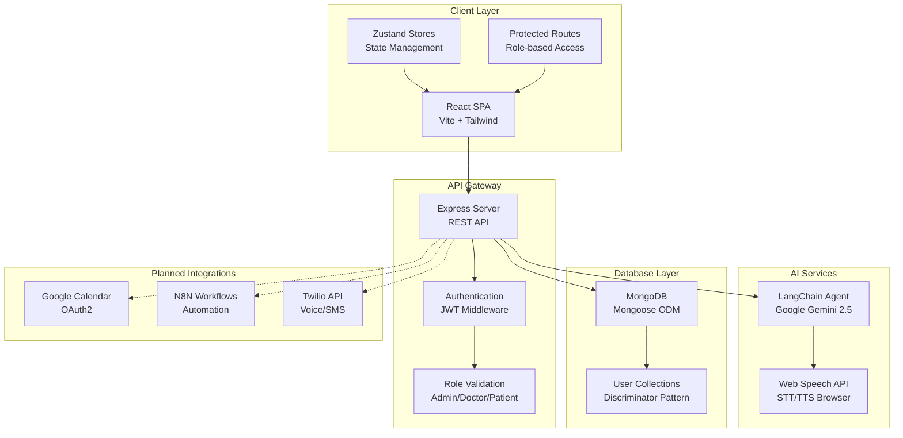

# 🏥 HealthCare AI - AI-Enabled Healthcare CRM System

> **Your Health, Our Priority - Smart Healthcare Management Platform**

     

---

## 📋 Table of Contents

- [Overview](#-overview)
- [Key Features](#-key-features)
- [Tech Stack](#-tech-stack)
- [Architecture](#-architecture)
- [Installation & Setup](#-installation--setup)
- [Usage Guide](#-usage-guide)
- [API Documentation](#-api-documentation)
- [Project Structure](#-project-structure)
- [Screenshots](#-screenshots)
- [Roadmap](#-roadmap)
- [Contributing](#-contributing)
- [License](#-license)
- [Authors & Acknowledgments](#-authors--acknowledgments)
- [Contact & Support](#-contact--support)

---

## 🌟 Overview

**HealthCare AI** is a cutting-edge, AI-enabled healthcare appointment management system designed to revolutionize patient care delivery and medical practice efficiency. Built for the BPUT Hackathon 2025, this comprehensive platform eliminates manual CRM intervention, reduces appointment delays, and ensures consistent communication through intelligent automation.

The system leverages advanced AI technologies including **LangChain** and **Google Gemini 2.5 Flash** to provide natural language processing, symptom-based doctor recommendations, and voice-enabled interactions. Our platform transforms traditional healthcare management by offering seamless appointment booking, real-time availability checking, and multi-channel automated reminders.

**Key Differentiator**: Our AI chat assistant supports both text and voice interactions using browser-native Web Speech API, making healthcare accessible to users with varying technical abilities and preferences.

---

## ✅ Key Features

### 👨‍💼 Role-Based Access Control
- **Admin Portal**: User management, doctor management, system analytics, settings configuration
- **👨‍⚕️ Doctor Portal**: Patient management, appointment scheduling, medical records access, availability management
- **👤 Patient Portal**: Appointment booking, doctor discovery, health profile management, medical history tracking

### 🤖 AI-Powered Features
- ✅ **Intelligent Chat Assistant** using LangChain + Google Gemini 2.5 Flash
- ✅ **Symptom-based Doctor Recommendations** with 18 medical specializations
- ✅ **Voice Input/Output** using browser Web Speech API (STT/TTS)
- ✅ **Natural Language Appointment Booking** through conversational AI
- 🚧 **Automated Appointment Reminders** (SMS, Email, WhatsApp) - Planned
- 🚧 **AI Voice Calling System** (Twilio integration) - Planned

### 📅 Appointment Management
- ✅ **Real-time Doctor Availability** with 30-minute slot calculation
- ✅ **7-Step Booking Validation** (availability, double-booking prevention, future date validation)
- ✅ **Calendar View** with react-big-calendar (month/week/day/agenda views)
- ✅ **Status Workflow**: Scheduled → Confirmed → In Progress → Completed
- ✅ **Reschedule and Cancellation** with reason tracking
- 📅 **Google Calendar Sync** - Planned

### 📈 Analytics & Insights
- ✅ **Role-specific Dashboards** with key metrics
- ✅ **Interactive Charts** using Recharts (pie, line, bar charts)
- ✅ **Appointment Status Distribution** visualization
- ✅ **Patient/Doctor/Appointment Statistics**
- ✅ **Recent Activity Tracking**

### 💊 Medical Records Management
- ✅ **Comprehensive Patient Profiles** (medical history, allergies, medications)
- ✅ **Emergency Contact & Insurance** information
- ✅ **Health Metrics** (blood group, height, weight, BMI calculation)
- ✅ **Doctor Credentials Management** (qualifications, experience)
- ✅ **Availability Schedule Editor** for doctors

### 🔍 Advanced Search & Filtering
- ✅ **Multi-parameter Search** (name, email, specialization, department)
- ✅ **Smart Filtering** by status, type, date range, blood group
- ✅ **Pagination Support** (10/20/50 items per page)
- ✅ **Multi-field Sorting** (name, date, experience)

### 🔒 Security & Compliance
- ✅ **JWT Authentication** with httpOnly cookies
- ✅ **Password Hashing** using bcryptjs (10 salt rounds)
- ✅ **Role-based Middleware** protection (isAdmin, isDoctor, isPatient)
- ✅ **256-bit SSL Encryption** ready for production
- ✅ **HIPAA Compliance** architecture
- ✅ **Protected Routes** with automatic redirection

### 🎨 Modern UI/UX
- ✅ **Healthcare-themed Design** (medical blue #0066CC, #4A90E2)
- ✅ **Responsive Design** (mobile-first approach)
- ✅ **Reusable Component Library** (SearchBar, DataTable, Modal, ConfirmDialog)
- ✅ **Loading States** with skeleton screens
- ✅ **Error Handling** with retry mechanisms
- ✅ **Success/Error Notifications**
- ✅ **Smooth Animations** and transitions

---

## 🛠 Tech Stack

### Frontend
- **Framework**: React 19.1.1 with Vite 7.1.2
- **Routing**: React Router DOM 7.9.4
- **State Management**: Zustand 5.0.8
- **Styling**: Tailwind CSS 4.1.14
- **UI Components**: React Icons 5.5.0
- **Charts**: Recharts 3.3.0
- **Calendar**: React Big Calendar 1.19.4
- **Date Handling**: date-fns 4.1.0
- **HTTP Client**: Axios 1.12.2
- **Markdown**: React Markdown 10.1.0

### Backend
- **Runtime**: Node.js with Express 5.1.0
- **Database**: MongoDB with Mongoose 8.19.1
- **AI/ML**: LangChain 1.0.1 + Google Gemini 2.5 Flash (@langchain/google-genai 1.0.0)
- **Authentication**: JWT (jsonwebtoken 9.0.2) + bcryptjs 3.0.2
- **Middleware**: CORS 2.8.5, Cookie Parser 1.4.7
- **Environment**: dotenv 17.2.3

### Planned Integrations
- 📅 **Google Calendar API** (OAuth2)
- 🔄 **N8N Workflow Automation**
- ☎️ **Twilio VoIP** (AI Voice Calling)
- 📱 **SMS/Email/WhatsApp** Notifications

---

## 🏗 Architecture



### Database Schema Overview
- **User Model**: Base schema with discriminators for role-based inheritance
- **Patient Model**: Extends User with medical fields (history, allergies, medications)
- **Doctor Model**: Extends User with professional fields (specializations, availability)
- **Appointment Model**: Links patients and doctors with booking details

### Frontend Architecture
- **Component-based Architecture**: Reusable UI components with healthcare theme
- **Zustand State Management**: 6 stores (auth, admin, doctor, patient, ai, home)
- **Protected Routes**: Role-based access control with automatic redirection
- **Axios Interceptors**: Token handling and automatic refresh

---

## 🚀 Installation & Setup

### Prerequisites
- **Node.js** (v18 or higher)
- **MongoDB** (v6 or higher)
- **npm** or **yarn** package manager
- **Google Gemini API** key (for AI features)

### Step-by-Step Installation

#### 1. Clone Repository
```bash
git clone <repository-url>
cd "06.BPUT Hackathaon 2025"
```

#### 2. Backend Setup
```bash
cd server
npm install
```

#### 3. Environment Configuration
Create `.env` file in server directory:
```env
MONGODB_URI=mongodb://localhost:27017/healthcare-crm
JWT_SECRET=your_jwt_secret_key_here
NODE_ENV=development
PORT=5000
GOOGLE_API_KEY=your_gemini_api_key_here
```

#### 4. Database Seeding (Optional)
```bash
node feed.js
```
**Populates database with:**
- 2-3 Admin users
- 8-10 Doctors (various specializations)
- 15-20 Patients (with medical records)
- 25-35 Appointments (past, present, future)

#### 5. Start Backend Server
```bash
npm run dev  # Development with nodemon
# OR
npm start    # Production
```
**Server runs on:** http://localhost:5000

#### 6. Frontend Setup
```bash
cd ../client
npm install
```

#### 7. Frontend Environment Configuration
Create `.env.development` file in client directory:
```env
VITE_API_URL=http://localhost:5000/api
```

#### 8. Start Frontend Development Server
```bash
npm run dev
```
**Application runs on:** http://localhost:5173

#### 9. Access the Application
Open browser and navigate to **http://localhost:5173**

**Sample Credentials (after seeding):**
- **Admin**: admin1@hospital.com / Admin@123
- **Doctor**: [from seed output] / Doctor@123
- **Patient**: [from seed output] / Patient@123

---

## 📖 Usage Guide

### For Patients 👤
1. **Register/Login** to patient portal
2. **Complete Health Profile** (medical history, allergies, medications)
3. **Search Doctors** by specialization or use AI assistant for recommendations
4. **Book Appointments** with real-time availability checking
5. **Manage Appointments** (view, reschedule, cancel)
6. **Receive Automated Reminders** via multiple channels (planned)

### For Doctors 👨‍⚕️
1. **Login** to doctor portal
2. **Set Availability Schedule** and professional credentials
3. **Manage Patients** and their medical records
4. **View Appointment Schedule** (list/calendar views)
5. **Update Appointment Status** (scheduled → confirmed → in progress → completed)
6. **Access Patient History** before appointments

### For Admins 👨‍💼
1. **Login** to admin portal
2. **Manage Users** (patients, doctors, admins)
3. **View System Analytics** and metrics
4. **Configure Settings** and notification preferences
5. **Monitor Platform** usage and performance

### Using AI Assistant 🤖
1. **Click AI Chat Icon** in bottom-right corner
2. **Type Message** or click microphone for voice input
3. **Ask About**: platform features, doctor recommendations, appointment booking
4. **Follow Conversational Flow** for appointment booking
5. **AI Responds** with text and voice output

---

## 📚 API Documentation

### Authentication Endpoints
- `POST /api/auth/register` - Register new user (patient)
- `POST /api/auth/login` - Login user
- `POST /api/auth/logout` - Logout user
- `GET /api/auth/profile` - Get current user profile
- `PUT /api/auth/profile` - Update user profile
- `PUT /api/auth/password` - Change password

### Admin Endpoints
- `GET /api/admin/dashboard` - Get admin analytics
- `GET /api/admin/patients` - Get all patients (with search/filter/pagination)
- `POST /api/admin/patients` - Create new patient
- `GET /api/admin/patients/:id` - Get patient by ID
- `PUT /api/admin/patients/:id` - Update patient
- `DELETE /api/admin/patients/:id` - Delete patient
- `GET /api/admin/doctors` - Get all doctors (with search/filter/pagination)
- `POST /api/admin/doctors` - Create new doctor
- `GET /api/admin/doctors/:id` - Get doctor by ID
- `PUT /api/admin/doctors/:id` - Update doctor
- `DELETE /api/admin/doctors/:id` - Delete doctor
- `GET /api/admin/public/doctors` - Get featured doctors (public, no auth)

### Doctor Endpoints
- `GET /api/doctor/dashboard` - Get doctor analytics
- `GET /api/doctor/patients` - Get assigned patients (with search/filter/pagination)
- `POST /api/doctor/patients` - Create new patient
- `GET /api/doctor/patients/:id` - Get patient by ID
- `PUT /api/doctor/patients/:id` - Update patient
- `DELETE /api/doctor/patients/:id` - Delete patient
- `GET /api/doctor/appointments` - Get doctor's appointments (with filters)
- `POST /api/doctor/appointments` - Create appointment
- `GET /api/doctor/appointments/:id` - Get appointment by ID
- `PUT /api/doctor/appointments/:id` - Update appointment
- `DELETE /api/doctor/appointments/:id` - Delete appointment
- `PUT /api/doctor/profile` - Update doctor professional profile

### Patient Endpoints
- `GET /api/patient/dashboard` - Get patient dashboard data
- `GET /api/patient/profile` - Get patient profile
- `PUT /api/patient/profile` - Update patient profile
- `POST /api/patient/profile/medical-history` - Add medical history entry
- `POST /api/patient/profile/allergies` - Add allergy entry
- `POST /api/patient/profile/medications` - Add medication entry
- `GET /api/patient/doctors` - Search doctors (with filters)
- `GET /api/patient/doctors/:id` - Get doctor details
- `GET /api/patient/doctors/availability/check` - Check doctor availability
- `GET /api/patient/appointments` - Get patient's appointments (with filters)
- `POST /api/patient/appointments` - Book new appointment
- `GET /api/patient/appointments/:id` - Get appointment by ID
- `PUT /api/patient/appointments/:id` - Update appointment (limited fields)
- `PUT /api/patient/appointments/:id/cancel` - Cancel appointment
- `PUT /api/patient/appointments/:id/reschedule` - Reschedule appointment
- `GET /api/patient/settings` - Get patient settings
- `PUT /api/patient/settings` - Update patient settings
- `PUT /api/patient/settings/password` - Change password

### AI Endpoints
- `POST /api/ai/chat` - Send message to AI assistant

---

## 📁 Project Structure

```
📁 Project Root
├── 📁 client/                 # Frontend React Application
│   ├── 📁 src/
│   │   ├── 📁 components/      # Reusable UI Components
│   │   │   ├── SearchBar.jsx
│   │   │   ├── DataTable.jsx
│   │   │   ├── Modal.jsx
│   │   │   ├── ConfirmDialog.jsx
│   │   │   ├── ProtectedRoute.jsx
│   │   │   ├── Header/, Nav/, Footer/, AI/
│   │   ├── 📁 pages/           # Page Components
│   │   │   ├── Admin/          # Admin Portal (6 pages)
│   │   │   ├── Doctor/         # Doctor Portal (6 pages)
│   │   │   ├── Users/          # Patient Portal (4 pages)
│   │   │   ├── Auth/           # Login, Register
│   │   │   └── Home/           # Landing Page
│   │   ├── 📁 stores/          # Zustand State Management
│   │   │   ├── authStore.js
│   │   │   ├── adminStore.js
│   │   │   ├── doctorStore.js
│   │   │   ├── patientStore.js
│   │   │   ├── aiStore.js
│   │   │   └── homeStore.js
│   │   ├── 📁 config/          # Configuration
│   │   │   ├── axios.js
│   │   │   └── branding.js
│   │   ├── 📁 utils/           # Utility Functions
│   │   ├── App.jsx
│   │   └── main.jsx
│   ├── package.json
│   └── vite.config.js
├── 📁 server/                # Backend Node.js Application
│   ├── 📁 controllers/     # Request Handlers
│   │   ├── user.controller.js
│   │   ├── admin.controller.js
│   │   ├── doctor.controller.js
│   │   ├── patient.controller.js
│   │   └── ai.controller.js
│   ├── 📁 models/          # Mongoose Schemas
│   │   ├── user.model.js
│   │   ├── patient.model.js
│   │   ├── doctor.model.js
│   │   └── appointment.model.js
│   ├── 📁 routes/          # API Routes
│   ├── 📁 middlewares/     # Auth & Validation
│   ├── 📁 utils/           # Helper Functions
│   │   ├── agent.js        # LangChain AI Agent
│   │   └── generateToken.js
│   ├── 📁 config/          # Database Config
│   ├── index.js            # Server Entry Point
│   ├── feed.js             # Database Seeding Script
│   └── package.json
└── README.md
```

---

## 📸 Screenshots

> **Note:** Screenshots coming soon. Please add screenshots to `/screenshots` folder.

### Landing Page

*Home.jsx with featured doctors and platform overview*

### Admin Dashboard

*Analytics and charts with system-wide metrics*

### Doctor Portal

*Appointment calendar view with patient management*

### Patient Portal

*Appointment booking flow with doctor search*

### AI Chat Assistant

*Voice-enabled chat interface with conversation flow*

### Mobile Responsive

*Responsive design across different screen sizes*

---

## 🗓 Roadmap

### ✅ Completed Features
- Role-based authentication and authorization
- Admin, Doctor, and Patient portals with distinct dashboards
- Appointment management with calendar integration
- Medical records management with comprehensive schemas
- AI chat assistant with voice input/output capabilities
- Doctor search and real-time availability checking
- Analytics dashboards with interactive charts
- Responsive UI with healthcare-themed design

### 🚧 In Progress
- **Google Calendar Integration** - OAuth2 implementation for appointment sync
- **N8N Workflow Automation** - Advanced notification workflows
- **AI Voice Calling System** - Twilio integration for automated calls

### 📅 Planned Features
- **Multi-channel Notifications** (SMS, Email, WhatsApp)
- **Payment Gateway Integration** for consultation fees
- **Telemedicine Video Consultations** with WebRTC
- **Prescription Management** with digital signatures
- **Lab Report Integration** with file uploads
- **Multi-language Support** for diverse patient base
- **Mobile App** (React Native) for enhanced accessibility
- **Advanced Analytics** with ML insights and predictive modeling

---

## 🤝 Contributing

We welcome contributions from the healthcare and developer community!

### How to Contribute
1. **Fork the Repository**
2. **Create Feature Branch**: `git checkout -b feature/AmazingFeature`
3. **Commit Changes**: `git commit -m 'Add some AmazingFeature'`
4. **Push to Branch**: `git push origin feature/AmazingFeature`
5. **Open Pull Request**

### Code Style Guidelines
- Follow **ESLint** configuration
- Use **Prettier** for code formatting
- Write **meaningful commit messages**
- Add **comments** for complex logic
- Follow **component naming conventions**
- Maintain **healthcare theme consistency**
- Write **tests** for new features
- Update **documentation** for API changes

### Areas for Contribution
- 🐛 Bug fixes and performance improvements
- ✨ New features and enhancements
- 📚 Documentation improvements
- 🧪 Test coverage expansion
- 🎨 UI/UX enhancements
- 🌐 Accessibility improvements
- 🔒 Security audits and fixes

---

## 📄 License

This project is licensed under the **MIT License** - see the [LICENSE](LICENSE) file for details.

---

## 👥 Authors & Acknowledgments

### Author
**Manash Ranjan**
- 🎓 Role: Full Stack Developer
- 💼 GitHub: [ManashR7488](https://github.com/ManashR7488)
- 💼 LinkedIn: [Connect with Manash](https://linkedin.com/in/manash-ranjan)

### Acknowledgments
- 🏆 **BPUT Hackathon 2025** organizers for providing the platform
- 🤖 **LangChain** and **Google Gemini AI** teams for cutting-edge AI tools
- 🌟 **Open Source Community** for invaluable libraries and frameworks
- 👩‍⚕️ **Healthcare Professionals** for domain expertise and guidance
- 🎓 **Academic Mentors** for project guidance and support

---

## 📞 Contact & Support

### Get Help
- 🐛 **Report Bugs**: [GitHub Issues](https://github.com/ManashR7488/Hospital-CRM-System/issues)
- 💡 **Request Features**: [GitHub Issues](https://github.com/ManashR7488/Hospital-CRM-System/issues/new?assignees=&labels=enhancement&template=feature_request.md)
- 💬 **Discussions**: [GitHub Discussions](https://github.com/ManashR7488/Hospital-CRM-System/discussions)
- 📧 **Email**: support@healthcareai.com

### Environment Variables Reference

| Variable | Description | Required | Default | Example |
|----------|-------------|----------|---------|---------|
| `MONGODB_URI` | MongoDB connection string | ✅ Yes | - | `mongodb://localhost:27017/healthcare-crm` |
| `JWT_SECRET` | Secret key for JWT tokens | ✅ Yes | - | `your_super_secret_key_here` |
| `GOOGLE_API_KEY` | Google Gemini AI API key | ✅ Yes | - | `AIzaSyC-your-api-key-here` |
| `NODE_ENV` | Environment mode | ❌ Optional | `development` | `production` |
| `PORT` | Server port number | ❌ Optional | `5000` | `3000` |

### Troubleshooting

#### Common Issues

**MongoDB Connection Error**
```bash
Error: connect ECONNREFUSED 127.0.0.1:27017
```
**Solution**: Ensure MongoDB is running locally or check connection string.

**Port Already in Use**
```bash
Error: listen EADDRINUSE: address already in use :::5000
```
**Solution**: Change PORT in `.env` or kill existing process: `npx kill-port 5000`

**CORS Issues**
```bash
Access to fetch blocked by CORS policy
```
**Solution**: Verify `VITE_API_URL` in client `.env.development` matches server URL.

**AI API Key Error**
```bash
Error: Google API key not found
```
**Solution**: Add valid `GOOGLE_API_KEY` to server `.env` file.

### Performance Optimization

**Implemented Optimizations:**
- ✅ **Pagination** for large datasets (10/20/50 items per page)
- ✅ **Lazy Loading** for calendar component
- ✅ **Debounced Search** inputs (300ms delay)
- ✅ **Memoized Calendar Events** to prevent re-renders
- ✅ **Axios Interceptors** for efficient token management
- ✅ **Component Memoization** for expensive operations

### Security Best Practices

**Implemented Security Measures:**
- 🔐 **JWT tokens** stored in httpOnly cookies
- 🔒 **Password hashing** with bcryptjs (10 salt rounds)
- 🛡️ **Role-based access control** with middleware validation
- ✅ **Input validation** on frontend and backend
- 🔗 **Protected API routes** with authentication checks
- 🌐 **CORS configuration** for secure cross-origin requests
- 📝 **Request rate limiting** (planned for production)

---

> **Built with ❤️ for better healthcare accessibility and patient care.**

**Star ⭐ this repository if you found it helpful!**